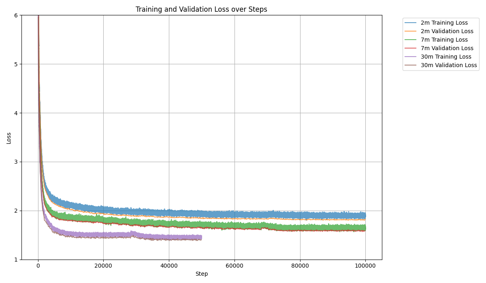

# StoryLlamas
LLM pretraining is outside of my compute budget ($0), but I still wanted to train some models. As it turns out you can actually get pretty interesting results training very small LMs on the [TinyStories](https://huggingface.co/datasets/roneneldan/TinyStories) dataset.

I trained 2m, 7m and 30m parameter models with the Llama 3 architecture:


## Tokenizer
If you want to train your own tokenizer, start by downloading the dataset:
```bash
cd tokenizer && python download_datset.py
```
And train your own tokenizer:
```bash
python train_tokenizer.py --vocab_size <vocab size>
```
As a quickstart you can just the one I trained `tokenizer/tokenizer_4096.model`

## Dataset
For performance its common to pretokenize the datasets, you can do so with `data/pretokenize.py`:
```bash
cd data && pretokenize.py --output_file train.bin --model_file tokenizer/tokenizer_4096.model --dataset_file TinyStories-train.txt
```
And for validation:
```bash
pretokenize.py --output_file val.bin --model_file tokenizer/tokenizer_4096.model --dataset_file TinyStories-valid.txt
```

## Training
My architectures are available in `config.py`, its easily hackable to add new ones though. To train run:
```bash
python train.py --config 2m --corpus-bin data/train.bin --corpus-val-bin data/val.bin --n-steps 50000
```
On my 1x8GB RTX 2070 training took ~overnight for 2m/7m and ~2 days for the 30m model.
For a full list of args see `train.py`, the hyperparameters I used were:
| Model | total-batch-size | n-steps | learning-rate | weight-decay |
|-------|------------------|---------|---------------|--------------|
| `2m`  | 2**16            | 100k    | 1e-3          | 0.01
| `7m`  | 2**16            | 100k    | 1e-3          | 0.01
| `30m` | 2**17            | 50k     | 8e-4          | 0.05

## Create stories
Now you can have the model write stories using `generate.py`:
```bash
python generate.py --config 2m --checkpoint-path checkpoint.pt --prompt "Once upon a time"
```
Here is what I got

`30m`:
>Once upon a time, there was a small girl named Lily. One day, she went for a walk in the woods near her house. Suddenly, she saw a bright light in the distance. She wanted to go see what it was, but she was scared. Later that day, Lily saw a big, fierce wolf in the woods. The wolf had sharp teeth and was scaring the animals. She knew she had to do something. Lily had to think long and hard. She had an idea. She said, "I will pretend I am a brave girl like you and not scare the dog." And she pretended to be a brave knight. The wolf saw her and ran away. Lily stayed behind the bushes and watched the wolf go. She felt brave and kept pretending. When she went back home, she took a deep breath and told herself, "I will use my strength to scare the wolf away."

`7m`:
>Once upon a time, there was a little girl named Lily. She had four favorite teddy bear that she loved very much. One day, Lily's little brother Ben came outside with his teddy bear. Ben asked him if he could play with it, but he said no. Lily felt sad and guilty that she didn't have a friend to play with. But then, her parents said it was okay and they could still have fun together. They played with more toys and had so much fun. Lily realized that it was better to make friends than to lose her teddy bear, so she made lots of new friends and learned that it didn't matter how loud you feel. From that day on, Lily made sure to always be kind and friendly to everyone she met.

`2m`:
>Once upon a time, there was a little boy named Timmy. Timmy loved to play outside in the wide springtime. He loved to play and have fun. One day, he saw another squirrel outside the stream. It was a pretty sight - a small squirrel that was very cute. Timmy wanted to chase the squirrel, but the squirrel didn't know how to hold it up. So, then, Timmy saw a squirrel playing with a ball in the stream. He was having so much fun, he forgot all about being too close to the squirrel. The squirrel didn't listen and found the squirrel. Timmy felt safe and happy that he could help the squirrel. He was very happy that he could help the squirrel and that he did a great job. From that day on, the squirrel always remembered the day they played together in the spring spring.

Not too bad!

## Acknowledgements

1. [TinyStories: How Small Can Language Models Be and Still Speak Coherent English? (Eldan & Li, ICLR 2024)](https://arxiv.org/abs/2305.07759)
2. [The Llama 3 Herd of Models](https://arxiv.org/abs/2407.21783)
